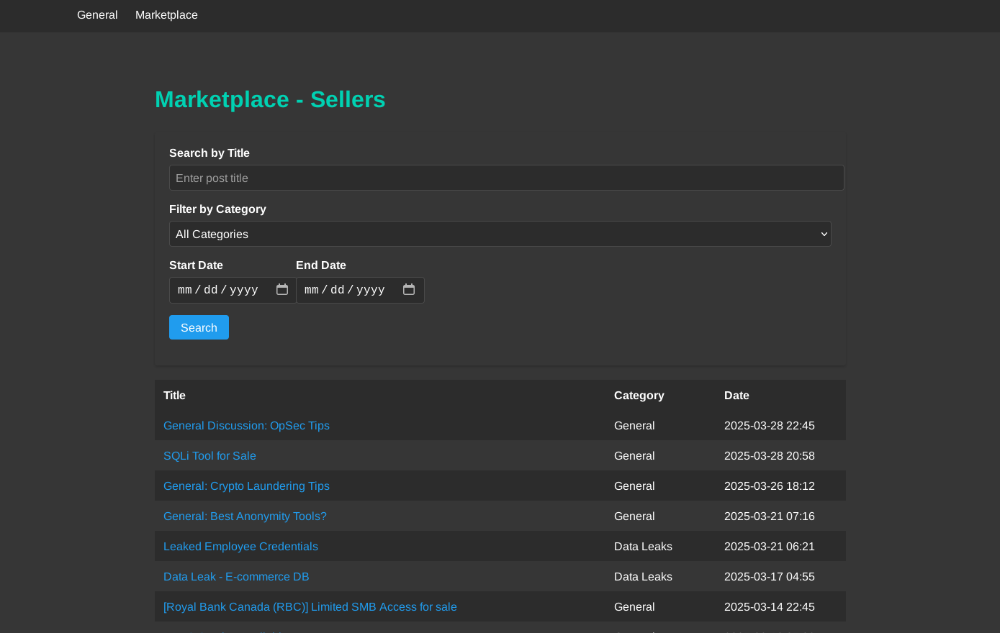

# Darknet Simulation Forum

This Flask-based web application simulates a darknet forum, featuring user profiles, categorized posts, comments, and a marketplace for buyer and seller listings. It uses SQLite for data storage and integrates with Tor for anonymous access via onion routing. The application is containerized with Docker and orchestrated using Docker Compose.


## Features
- User profiles with usernames, bios, join dates, and reputation scores
- Marketplace for buyer and seller posts, filterable by title, category, and date
- Comment system for post interactions
- Detailed post views with content and comments
- Tor integration for anonymous access through an onion address
- Responsive HTML templates for all pages


## Technology stack:
- Backend
    - Flask
    - SQLAlchemy ORM
- Database
    - SQLite
- Frontend
    - HTML & CSS


## Project Structure
- app.py: Main Flask application with routes and database models
- populate.py: Script to initialize the SQLite database with sample data
- Dockerfile: Defines the Flask app container
- docker-compose.yaml: Configures Flask and Tor services
- requirements.txt: Python dependencies
- templates/: HTML templates for rendering pages
- tor/torrc: Tor configuration file
- instance/forum.db: SQLite database (created on startup)


## Prerequisites
- Docker
- Docker Compose
- Tor Browser (for accessing the onion address)
- Python 3.9 or up (optional, for local development without Docker)


## Setup and Installation

1. **Clone the Repository**
```
git clone <repository-url>
cd darknet-simulation-forum
```

2. **Build and Run with Docker Compose**
```
docker-compose up --build -d
```
   This command:
   - Builds the Flask app container in detached mode
   - Starts the Tor service
   - Creates a bridge network (onion_net) for communication
   - Initializes the SQLite database with sample data via populate.py
   - Runs the Flask app with Gunicorn on port 5000

3. **Access the Application**
   - **Local Access**: Open `http://localhost:5000` in a browser
   - **Tor Access**: Retrieve the onion address with:
     `sudo docker exec -it tor_service cat /var/lib/tor/hidden_service/hostname`
     Use the output (e.g., xyz.onion) in a Tor Browser to access the forum anonymously

4. **Stop the Application**
   `sudo docker-compose down`
   To reset the database and remove volumes:
   `sudo docker-compose down -v`


## Usage
- **Home Page**: View recent posts and new members
- **Marketplace**: Browse buyer and seller listings
- **Buyers/Sellers Pages**: Filter posts by title, category, or date range
- **Post Details**: Read post content and comments
- **User Profiles**: View user information and their posts


## Database
- SQLite database (forum.db) is stored in instance/, persisted via a Docker volume (db-data)
- Models: User, Category, Post, Comment
- Sample data is populated by `populate.py` on container startup


## Tor Configuration
- Tor is configured via `tor/torrc`
- The hidden service is set up automatically, with the onion address available in the Tor container
- Tor Browser is required to access the onion address


## Development
For local development without Docker:
1. Install dependencies:
   `pip install -r requirements.txt`
2. Initialize the database:
   `python populate.py`
3. Run the Flask app:
   `python app.py`
   Access at http://localhost:5000


## Notes
- This is a simulation and should not be used for illegal activities
- Docker commands may require sudo depending on your system
- Ensure Tor Browser is installed for onion access
- Database is reset when using `docker-compose down -v`


